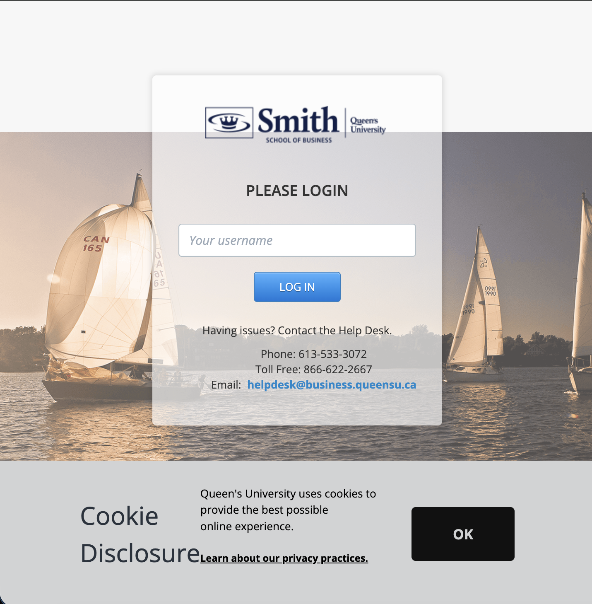

# How Queen's SSO Works

> This is outdated and for now is a form of authentication, we're no longer pursuing

## Verifying ID against Queen's Database

First, you need to check against the Queen's database if your NetID is still active. Normally, this all happens when you go to login into D2L, this is where it has a textbox that asks for your username.



1. Send the following request with your NetID

```
curl --location 'https://web.prod.business.queensu.ca/Login/userProvider?userName=${netId}' \
```

The expected response should be:

```
{
    "userProvider": "ad"
}
```

which signals that your NetID is an active account.

2. Go to the SAML Login

First, normally on login, Queen's will redirect you to a page in order to get a requestID. Here's what a sample request looks like to get it:

```
curl --location 'https://web.prod.business.queensu.ca/Login/saml?username=${netId}8&returnUrl=%2FLogin%2FSSO%2Fd2l%3Ftarget%3D%2Fd2l%2Fhome' \
--header 'Accept: text/html,application/xhtml+xml,application/xml;q=0.9,image/avif,image/webp,image/apng,*/*;q=0.8,application/signed-exchange;v=b3;q=0.7' \
--header 'Accept-Language: en-CA,en;q=0.9' \
--header 'Connection: keep-alive' \
--header 'Referer: https://web.prod.business.queensu.ca/Login/login?returnUrl=/Login/SSO/d2l%3ftarget%3d%2fd2l%2fhome' \
```

Then, in the response, find the following script:

```
<script type="text/javascript" nonce="2K4UV__-lhrrXkUSQKz5Ew">
```

look into the `$Config` JSON and then extract the `urlPost` field, here's what it looks like:

```
urlPost:
    '/${tenantId}/saml2?SAMLRequest=${requestId}\u0026RelayState=localReturnUrl%3d%2fLogin%2fSSO%2fd2l%3ftarget%3d%2fd2l%2fhome\u0026login_hint=${studentEmail}.ca\u0026client-request-id=${requestId}\u0026sso_reload=True',
```

This contains the SAMLRequest ID and the client-request-id, you'll need both.

Send a request here to get the Microsoft SSO login page.

```
curl --location 'https://web.prod.business.queensu.ca/Login/saml?username=${netId}%3FreturnUrl%3D%2FLogin%2FSSO%2Fd2l%3ftarget%3d%2fd2l%2fhome' \
```

In the response, you'll see this script tag:

```
<script type="text/javascript" nonce="P7stwgMoUY_2EWCCbmS96w">
```

That contains the `$Config` JSON. Here, look for the `sTenantId` field. This is your school's ID in Microsoft's database.

```
sTenantId: 'd61ecb3b-38b1-42d5-82c4-efb2838b925c',
```

Grab this tenant Id

The next thing in the Login flow is the actual page where you enter your password. Here, your NetID should already be logged in. You'll notice in the network tab that this request was sent:

```
curl --location 'https://aadcdn.msftauth.net/shared/1.0/content/js/ConvergedLogin_PCore_oIcnamzqPXD8MFvIvklPNg2.js' \
--header 'accept: */*' \
--header 'accept-language: en-CA,en;q=0.9' \
--header 'origin: https://login.microsoftonline.com' \
--header 'priority: u=1' \
--header 'referer: https://login.microsoftonline.com/' \
```

Which will add a number of hidden fields to the password form that need to be submitted as well:

```
<input type="hidden" name="ps" ... />
<input type="hidden" name="psRNGCDefaultType" ... />
<input type="hidden" name="psRNGCEntropy" ... />
<input type="hidden" name="psRNGCSLK" ... />
<input type="hidden" ... name: svr.sCanaryTokenName ... value: svr.canary />
<input type="hidden" name="canary" ... />
<input type="hidden" name="ctx" ... />
<input type="hidden" name="hpgrequestid" ... />
<input type="hidden" id="i0327" ... name: svr.sFTName ... value: flowToken" />
<input type="hidden" name="PPSX" ... />
<input type="hidden" name="NewUser" value="1" />
<input type="hidden" name="FoundMSAs" ... />
<input type="hidden" name="fspost" ... />
<input type="hidden" name="i21" ... />
<input type="hidden" name="CookieDisclosure" ... />
<input type="hidden" name="IsFidoSupported" ... />
<input type="hidden" name="isSignupPost" ... />
<input type="hidden" name="isRecoveryAttemptPost" ... />
<input type="hidden" name="DfpArtifact" ... />
<input type="hidden" name="targetCredentialForRecovery" ... />
```

So this javascript bundle will then send this request:

```
curl --location 'https://aadcdn.msftauth.net/shared/1.0/content/js/asyncchunk/convergedkmsi_customizationloader_22a83e6341cfb1e6253e.js' \
--header 'accept: */*' \
--header 'accept-language: en-CA,en;q=0.9' \
--header 'referer: https://login.microsoftonline.com/' \
```

Which hydrates the HTML on the password page. With all these hidden fields and information, this is what is sent to Microsoft to login:

```
curl 'https://login.microsoftonline.com/d61ecb3b-38b1-42d5-82c4-efb2838b925c/login' \
  -H 'accept: text/html,application/xhtml+xml,application/xml;q=0.9,image/avif,image/webp,image
```
